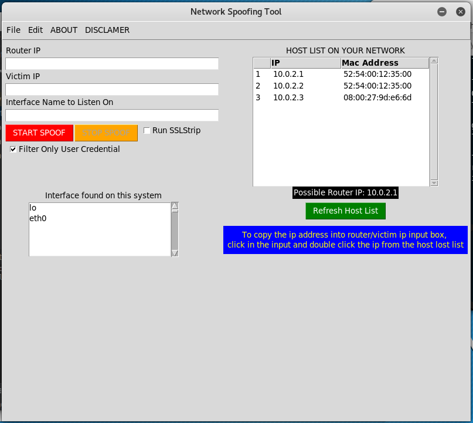

### INTRO
GUI Address Resolutions Protocol (APR) Spoofing written in python
 
## Features
- Discovers the list of host IP address and mac address in the local area network
- Shows the possible Gateway IP address
- Shows available network interfaces
- Sniff the basic http username and password

## How To
- slect input for router and double click on the router ip addres
- select input for victim ip and double click on the ip address of the vicitim you want to sniff the packet off of
- click on the interface name you want to listen to
- click on the START SPOOF
- watch the sniffing window

## Modules Used
- `socket`
- `threading`
- `tkinter`  for gui
- `scapy` 
- `scapy_http`

## Features to Implement 
- SSL sniffing
- Saving packet as pcap file
- Option to modify packet / code injection and sending it to the victim
 

